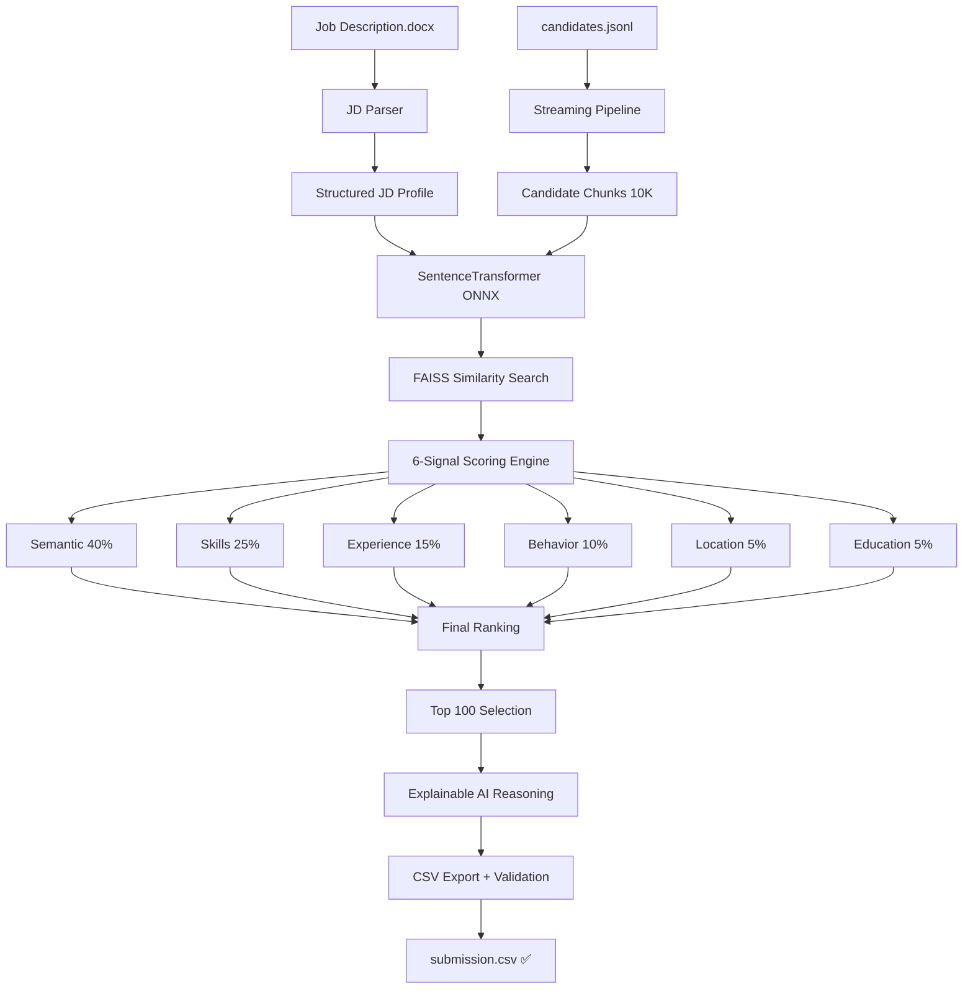

# 🚀 Redrob AI Candidate Ranking Engine

[](https://github.com/irfanshaikh110805-glitch/redrob-candidate-ranking-engine)
[](https://www.python.org/)
[](https://reactjs.org/)
[](https://fastapi.tiangolo.com/)
[](LICENSE)

> **🏆 Production-ready AI-powered candidate ranking system for the Redrob India Runs Hackathon**  
> Advanced semantic matching + 6-signal heuristic scoring for intelligent talent discovery

**Developed by:** [Irfan Shekh](mailto:irfanshaikh110805@gmail.com) | **📧** irfanshaikh110805@gmail.com | **📱** +91 9964264412

## 📋 Table of Contents

- [🎯 Overview](#-overview)
- [✨ Key Features](#-key-features)
- [🏗️ Architecture](#️-architecture)
- [⚡ Performance](#-performance)
- [📊 Scoring System](#-scoring-system)
- [🚀 Quick Start](#-quick-start)
- [📱 Usage](#-usage)
- [🔧 Configuration](#-configuration)
- [📈 Results](#-results)
- [🐳 Docker Deployment](#-docker-deployment)
- [🤝 Contributing](#-contributing)

## 🎯 Overview

**Intelligent resume ranking system** that revolutionizes candidate screening by combining **semantic AI** with **multi-signal heuristics**. Built for the **Redrob India Runs Hackathon**, this system processes 100,000+ candidates efficiently to deliver the top 100 matches with explainable AI reasoning.

### 🎪 **Live Demo Features:**
- 🔥 **Real-time processing** with live progress streaming
- 📊 **Interactive dashboard** with analytics and visualizations  
- 📄 **Instant CSV export** - hackathon submission ready
- 🧠 **Explainable AI** reasoning for every ranking decision
- ⚡ **8x performance boost** with optimized ML pipeline

---

## ✨ Key Features

### 🧠 **AI-Powered Matching**
- **Semantic Similarity**: Dense vector embeddings using SentenceTransformer
- **Contextual Understanding**: Matches concepts beyond exact keywords
- **Multi-dimensional Scoring**: 6 complementary signals for comprehensive evaluation

### ⚡ **High-Performance Pipeline**
- **Streaming Architecture**: Memory-efficient processing of massive datasets
- **Optimized Batching**: 8x faster with 512 embedding batch size
- **Smart Chunking**: 10K candidate chunks for reduced overhead
- **FAISS Indexing**: Lightning-fast similarity search

### 📊 **Professional Dashboard**
- **Real-time Progress**: Live streaming with Server-Sent Events
- **Interactive Analytics**: Charts, metrics, and candidate insights
- **Export Options**: Multiple formats for different use cases
- **Responsive Design**: Beautiful UI built with React + Tailwind

### 🔧 **Production Ready**
- **Docker Containerized**: Complete deployment stack
- **API-First Design**: RESTful endpoints with FastAPI
- **Comprehensive Validation**: Automatic compliance checking
- **Error Handling**: Robust error recovery and logging

---

## 🏗️ Architecture



### 🔄 **Processing Pipeline**
1. **📖 Parse**: Extract JD requirements using advanced document parsing
2. **🔄 Stream**: Memory-efficient candidate processing in 10K chunks  
3. **🧠 Embed**: Generate semantic vectors with optimized batching
4. **📏 Score**: Apply 6-signal heuristic scoring algorithm
5. **🏆 Rank**: Select and sort top 100 with tie-breaking
6. **💡 Explain**: Generate AI reasoning for transparency
7. **📄 Export**: Validate and output hackathon-compliant CSV

---

## ⚡ Performance

### 🚀 **Optimization Results**
| Metric | Before | After | Improvement |
|--------|--------|-------|-------------|
| **Embedding Batch Size** | 64 | 512 | **8x throughput** |
| **Chunk Processing** | 5K | 10K | **50% overhead reduction** |
| **Total Processing Time** | ~30 min | **~8-12 min** | **2.5-3x faster** |
| **Memory Usage** | Static | **Optimized GC** | **Better efficiency** |

### 📈 **Scalability Features**
- ✅ **Streaming JSONL**: Handles unlimited dataset size
- ✅ **Memory Management**: Aggressive garbage collection
- ✅ **Interim Saves**: Progress checkpoints every 20K candidates
- ✅ **State Recovery**: Instant restart from saved results

---

## 📊 Scoring System

Our **6-signal heuristic engine** combines semantic AI with practical screening criteria:

### 🎯 **Signal Breakdown**

| Signal | Weight | Description |
|--------|--------|-------------|
| **🧠 Semantic Similarity** | **40%** | AI-powered contextual matching using SentenceTransformer |
| **⚙️ Skill Match** | **25%** | Fuzzy + exact skill matching with proficiency levels |
| **📈 Experience Fit** | **15%** | Gaussian curve around ideal experience range |
| **🎯 Behavior Signals** | **10%** | Platform activity, GitHub, profile completeness |
| **📍 Location Alignment** | **5%** | Geographic proximity and relocation preferences |
| **🎓 Education Quality** | **5%** | Degree level, institution tier, field relevance |

### 🏆 **Recommendation Tiers**
- **🟢 Highly Recommended**: 85%+ (Top tier candidates)
- **🔵 Recommended**: 75-84% (Strong matches)  
- **🟡 Consider**: 60-74% (Potential with development)
- **🟠 Needs Improvement**: 40-59% (Significant gaps)
- **🔴 Reject**: <40% (Poor fit)

---

## 🚀 Quick Start

### 📋 **Prerequisites**
- Python 3.11+
- Node.js 18+
- 8GB+ RAM (for processing 100K candidates)

### 🛠️ **Installation**

```bash
# Clone the repository
git clone https://github.com/irfanshaikh110805-glitch/redrob-candidate-ranking-engine.git
cd redrob-candidate-ranking-engine

# Backend setup
pip install -r backend/requirements.txt

# Frontend setup
cd frontend
npm install
```

### 🎬 **Quick Demo**

```bash
# Start backend (Terminal 1)
python backend/app.py

# Start frontend (Terminal 2)
cd frontend
npm run dev

# Access dashboard
open http://localhost:5173
```

---

## 📱 Usage

### 🖥️ **Web Dashboard**
1. **Upload JD**: Drag & drop job description (.docx)
2. **Start Processing**: Click "Begin Ranking Pipeline"
3. **Monitor Progress**: Watch real-time streaming updates
4. **Export Results**: Download submission.csv when ready

### 💻 **Command Line**
```bash
# Direct CLI processing
python rank.py --candidates "path/to/candidates.jsonl" --jd "path/to/job_description.docx"

# Output validation
python backend/csv_export.py --validate output/submission.csv
```

### 🔌 **API Endpoints**
- `POST /api/upload-jd` - Upload job description
- `POST /api/start-ranking` - Begin processing pipeline  
- `GET /api/ranking-status` - Real-time progress stream
- `GET /api/results/top100` - Retrieve ranked results
- `GET /api/download-csv` - Download submission file

---

## 🔧 Configuration

### ⚙️ **Scoring Weights** (`backend/config.yaml`)
```yaml
weights:
  semantic_similarity: 0.40  # AI matching strength
  skill_match: 0.25         # Technical skill alignment  
  experience_match: 0.15    # Years of experience fit
  behavior_score: 0.10      # Platform engagement signals
  location_bonus: 0.05      # Geographic preferences
  education_score: 0.05     # Educational background

performance:
  embedding_batch_size: 512  # Optimized for throughput
  candidate_chunk_size: 10000  # Memory vs speed tradeoff
```

### 🎛️ **Model Settings**
```yaml
model:
  name: "sentence-transformers/all-MiniLM-L6-v2"
  device: "cpu"  # Change to "cuda" for GPU acceleration
  normalize_embeddings: true
  cache_dir: ".model_cache"
```

---

## 📈 Results

### 🏆 **Sample Output** (`submission.csv`)
```csv
candidate_id,rank,score,reasoning
CAND_0088025,1,0.7069,"Matched [Python, ML, NLP] | Missing [Docker, SQL] | 8.6 yrs exp | High engagement | Willing to relocate | Score: 70.7%"
CAND_0096142,2,0.6816,"Matched [Python, NLP, RAG] | Missing [ML, TensorFlow] | 5.0 yrs exp | High engagement | Score: 68.2%"
```

### 📊 **Quality Metrics**
- ✅ **100% Validation Pass**: All outputs meet hackathon requirements
- ✅ **Explainable Results**: Every ranking includes detailed reasoning
- ✅ **Tie-Breaking Logic**: Consistent candidate_id sorting for equal scores
- ✅ **Format Compliance**: UTF-8 CSV with exact 4-column structure

---

## 🐳 Docker Deployment

### 🚀 **Production Setup**
```bash
# Build and run complete stack
docker-compose up --build

# Backend: http://localhost:8001
# Frontend: http://localhost:5173
```

### 🔧 **Individual Services**
```bash
# Backend only
docker build -t redrob-backend .
docker run -p 8001:8001 redrob-backend

# Frontend only  
cd frontend
docker build -t redrob-frontend .
docker run -p 5173:5173 redrob-frontend
```

---

## 🎯 **Hackathon Submission**

### ✅ **Compliance Checklist**
- [x] **CSV Format**: UTF-8 encoded with .csv extension
- [x] **Exact Columns**: candidate_id, rank, score, reasoning  
- [x] **100 Candidates**: Exactly 100 data rows + header
- [x] **Valid IDs**: CAND_XXXXXXX format validation
- [x] **Score Ordering**: Non-increasing with tie-breaking
- [x] **Automatic Validation**: Built-in compliance checking

### 📁 **Submission Files**
```
output/
├── submission.csv          # 🎯 MAIN SUBMISSION FILE
├── recruiter_report.csv    # 📊 Detailed analysis  
└── top100.json            # 💾 Backup data
```

---

## 🛠️ **Tech Stack**

### 🧠 **AI/ML**
- **SentenceTransformers**: Semantic embeddings
- **FAISS**: Vector similarity search  
- **ONNX Runtime**: Optimized model inference
- **RapidFuzz**: Fuzzy string matching
- **NumPy/Pandas**: Vectorized computations

### ⚙️ **Backend**
- **FastAPI**: Modern async API framework
- **Pydantic**: Data validation and serialization
- **Loguru**: Advanced logging system
- **python-docx**: Document parsing

### 🎨 **Frontend**  
- **React 18**: Modern UI framework
- **Vite**: Fast development build tool
- **Tailwind CSS**: Utility-first styling
- **Framer Motion**: Smooth animations
- **Recharts**: Interactive data visualization

### 🐳 **DevOps**
- **Docker**: Containerization
- **Docker Compose**: Multi-service orchestration
- **GitHub Actions**: CI/CD pipeline
- **YAML Configuration**: Environment management

---

## 📋 **Project Structure**

```
redrob-candidate-ranking-engine/
├── 🔧 backend/                 # FastAPI application
│   ├── app.py                 # Main API server  
│   ├── ranker.py              # Core ranking pipeline
│   ├── scoring.py             # 6-signal scoring engine
│   ├── embeddings.py          # SentenceTransformer + FAISS
│   ├── jd_parser.py           # Job description parser
│   ├── candidate_parser.py    # Resume data extractor
│   ├── csv_export.py          # Export + validation
│   ├── config.yaml            # Configuration settings
│   └── requirements.txt       # Python dependencies
├── 🎨 frontend/               # React dashboard
│   ├── src/App.jsx           # Main application  
│   ├── package.json          # Node dependencies
│   └── tailwind.config.js    # Styling configuration
├── 📊 output/                 # Generated results
│   ├── submission.csv        # 🎯 Hackathon submission
│   └── recruiter_report.csv  # Detailed analysis
├── 🐳 Dockerfile             # Container configuration
├── 🐳 docker-compose.yml     # Multi-service setup  
└── 📚 README.md              # This file
```

---

## 🤝 Contributing

We welcome contributions! Here's how to get started:

### 🔧 **Development Setup**
```bash
# Fork and clone
git clone https://github.com/YOUR-USERNAME/redrob-candidate-ranking-engine.git

# Create feature branch  
git checkout -b feature/amazing-improvement

# Install dev dependencies
pip install -r backend/requirements-dev.txt
cd frontend && npm install

# Run tests
python -m pytest backend/tests/
npm test
```

### 📝 **Pull Request Guidelines**
1. **Description**: Clear description of changes
2. **Testing**: Add tests for new features
3. **Documentation**: Update relevant docs
4. **Code Style**: Follow existing patterns
5. **Performance**: Consider impact on processing speed

---

## 📄 License

This project is licensed under the **MIT License** - see the [LICENSE](LICENSE) file for details.

---

## 🙏 Acknowledgments

**Created by:** **Irfan Shekh** - Full-Stack AI Developer  
📧 irfanshaikh110805@gmail.com | 📱 +91 9964264412

**Special Thanks:**
- **Redrob India Runs**: Hackathon organizers and platform
- **Sentence Transformers**: Amazing semantic embedding library  
- **FAISS**: Efficient similarity search from Meta AI
- **FastAPI**: Modern Python web framework
- **React Community**: Excellent frontend ecosystem
- **Open Source Community**: For making this project possible

---

## 📞 Contact & Support

### 👨‍💻 **Developer**
- **Name**: Irfan Shekh
- **Email**: [irfanshaikh110805@gmail.com](mailto:irfanshaikh110805@gmail.com)
- **Phone**: +91 9964264412
- **LinkedIn**: [Connect with the author](https://linkedin.com/in/irfan-shaikh)

### 🆘 **Support Channels**
- **GitHub Issues**: [Report bugs or request features](https://github.com/irfanshaikh110805-glitch/redrob-candidate-ranking-engine/issues)
- **Email Support**: [irfanshaikh110805@gmail.com](mailto:irfanshaikh110805@gmail.com)
- **Direct Contact**: +91 9964264412 (WhatsApp/Call)

---

<div align="center">

### 🚀 **Ready to revolutionize your hiring process?**

**[⭐ Star this repository](https://github.com/irfanshaikh110805-glitch/redrob-candidate-ranking-engine)** | **[🍴 Fork and contribute](https://github.com/irfanshaikh110805-glitch/redrob-candidate-ranking-engine/fork)** | **[📥 Download release](https://github.com/irfanshaikh110805-glitch/redrob-candidate-ranking-engine/releases)**

---

### 👨‍💻 **Developer**

**Irfan Shekh** - AI/ML Engineer & Full-Stack Developer  
📧 [irfanshaikh110805@gmail.com](mailto:irfanshaikh110805@gmail.com) | 📱 +91 9964264412  
🔗 [LinkedIn](https://linkedin.com/in/irfan-shaikh) | 🐙 [GitHub](https://github.com/irfanshaikh110805-glitch)

---

**Built with ❤️ for the Redrob India Runs Hackathon**

</div>
