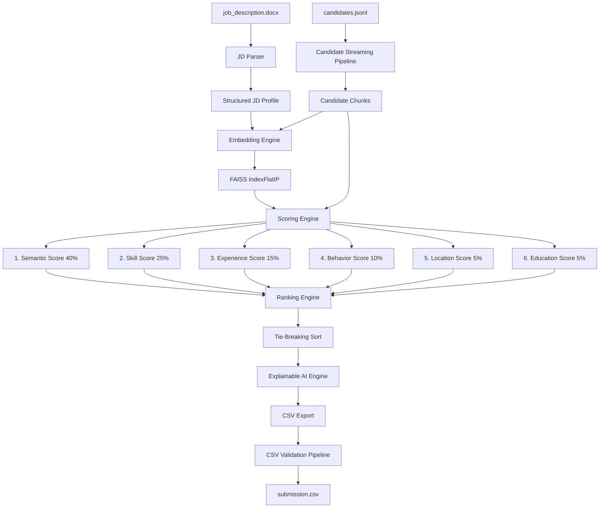

# AI Candidate Discovery & Ranking System

A candidate ranking engine built to match candidates against a single Job Description. This system supports local inference and can operate offline after the required models are downloaded.

---

## 1. System Architecture

The engine is built on a modular pipeline designed to parse, stream, embed, score, and rank candidates.



### 1.1 Step-by-Step Execution Workflow
1. **Parse Job Description (JD)**: The system parses the `.docx` file using `python-docx` to extract required skills, preferred skills, ideal experience years, location boundaries, and degrees.
2. **Stream Candidates**: Reads `candidates.jsonl` in memory-efficient chunks to minimize RAM usage.
3. **Semantic Embedding Vectorization**: Maps both the JD and the candidate profiles into vector spaces using a local SentenceTransformer (`all-MiniLM-L6-v2`) over ONNX Runtime and queries similarities via FAISS.
4. **Heuristic Scoring**: Combines semantic closeness with 5 other heuristic sub-scores (exact & fuzzy skill matching, Gaussian experience decay, behavioral signals, relocation preferences, and education tiers).
5. **Disqualify Invalid Profiles**: Identifies and disqualifies candidate profiles containing impossible timelines or inconsistent dates, setting their score to `0.0`.
6. **Tie-Breaking Sort**: Selects the top 100 profiles. If two profiles have identical scores, they are sorted alphabetically by their `candidate_id` in ascending order.
7. **AI Reasoning Generation**: Auto-generates a text explanation for each candidate's selection.
8. **Export & Verify**: Writes the top 100 to `submission.csv` and runs the validation checks programmatically.

---

## 2. Features

* **AI Candidate Ranking**: Ranks candidates against a Job Description using a combination of semantic and heuristic signals.
* **Semantic Matching**: Leverages dense vector search to match candidates contextually beyond exact keywords.
* **FAISS Similarity Search**: Builds an in-memory FAISS flat index to compute cosine similarities efficiently.
* **Explainable AI**: Generates human-readable descriptions of matches and missing elements for every selected candidate.
* **Skill Gap Analysis**: Compares candidate's skills against JD requirements, highlighting matches and deficiencies.
* **Recruiter Recommendation**: Classifies candidates into clear recommendation tiers based on final scores.
* **CSV Export**: Outputs results to a compliant 4-column CSV file.
* **Submission Validation**: Programmatically invokes the validator checks to verify format compliance.
* **Streaming JSONL Processing**: Iterates through large datasets line-by-line to avoid loading the entire database into memory.
* **FastAPI Backend**: Provides endpoints for uploading JDs, running ranking pipelines, and fetching status updates.
* **React Dashboard**: Offers a clean developer-centric user interface with live stats and radar chart summaries.
* **Configurable Scoring**: Allows weights, experience parameters, and location categories to be modified via YAML files.

---

## 3. Tech Stack

### Backend
* **Python**: Core logic and pipeline orchestration.
* **FastAPI**: API endpoints and Server-Sent Events (SSE).
* **NumPy**: Vectorized math operations.
* **Pandas**: Structured data management.
* **Sentence Transformers**: Generates text embeddings locally.
* **FAISS**: Performs fast dense vector similarity searches.
* **RapidFuzz**: Computes fuzzy skill match metrics.

### Frontend
* **React**: Interactive client interfaces.
* **Vite**: Frontend development and building.
* **Tailwind CSS**: Utility-first page styling.

### AI
* **all-MiniLM-L6-v2**: Local transformer model for sentence similarity.
* **Explainable AI**: Automatic text generation for scoring reasoning.
* **Semantic Search**: Multi-dimensional contextual matching.

---

## 4. Why This Approach?

Conventional candidate screening tools rely primarily on keyword matching, which fails to capture candidates who express similar concepts using different wording. This system combines **semantic similarity** (using dense vector embeddings) with **heuristic signals** (fuzzy skill matching, experience fit curves, education quality, behavioral activities, and location alignments). This guarantees a balanced scoring engine that values both background relevance and practical platform activity.

---

## 5. Core Heuristics & Scoring Weights

The final ranking score is a weighted combination of six normalized sub-scores, bounded strictly between `[0.0, 1.0]`. Scoring weights are configurable using `config.yaml`, allowing recruiters to prioritize different aspects of a candidate's profile based on the role.

| Signal Component | Weight | Logic & Computation Details |
| :--- | :---: | :--- |
| **Semantic Similarity** | **40%** | Cosine similarity between candidate composite text embedding and Job Description embedding via `SentenceTransformer(all-MiniLM-L6-v2)` on ONNX Runtime. |
| **Skill Match** | **25%** | Fuzzy matching of skills using `RapidFuzz` token-set ratio. Incorporates candidate proficiency levels (Expert: `1.0`, Advanced: `0.9`, Intermediate: `0.7`, Beginner: `0.4`), endorsements, and duration. Includes exact-match fast path for performance. |
| **Experience Fit** | **15%** | Gaussian decay curve centered around the Job Description's ideal experience range (`[ideal_min, ideal_max]`). Prioritizes candidates within the sweet spot and applies soft decay rather than hard thresholds. |
| **Behavioral Score** | **10%** | Aggregation of platform signals (profile completeness, recruiter response rate, assessment scores, open to work flags, connection counts, and GitHub activity). |
| **Location Fit** | **5%** | Tiers based on geographic proximity: Exact city match (`1.0`), same country/India (`0.6`), preferred remote mode/willing to relocate (`0.4`), no match (`0.0`). |
| **Education Score** | **5%** | Evaluation of degree levels (PhD: `1.0`, Master's: `0.85`, Bachelor's: `0.7`), institution tier (Tier 1-4), and CS/IT field relevance bonus (`+0.15`). |

---

## 6. High-Performance Design Details

The system is optimized for CPU execution and designed for large candidate datasets:

1. **Memory-Constrained JSONL Streaming**: Reads `candidates.jsonl` line-by-line rather than loading the entire file into RAM, keeping the memory footprint minimal during ranking. Explicit garbage collection (`gc.collect()`) is run at the end of each chunk.
2. **Compact Candidate Representations**: Candidate representation strings are compacted to focus strictly on relevant titles, summaries, and skills, yielding a short, clean context for the model.
3. **Exact-Match Fast Path**: Skill matching first checks if the skill name exists as an exact string in the candidate map, bypassing fuzzy search loops for common tech keywords.
4. **Reused Fuzzy Results**: Matched required skills are tracked during the scoring pass and reused directly in the reasoning generator to avoid duplicate RapidFuzz loops.
5. **State Restoration**: The API automatically persists the top results as `top100.json` upon completion. If the API service restarts, it reloads this state instantly, preventing the need to re-run the ranking pipeline.

---

## 7. Explainable AI Example

* **Candidate Score**: `92.4%`
* **Reasoning**:
  * Strong Python skills
  * Machine Learning experience
  * Relevant projects
  * High behavioral score
  * Good education match
* **Recommendation**: Highly Recommended

---

## 8. Project Directory Structure

```
├── backend/
│   ├── app.py                # FastAPI server (lifespan, endpoints, SSE streams)
│   ├── jd_parser.py          # Job Description parser (.docx section-aware extractor)
│   ├── candidate_parser.py   # Candidate profile parser & streaming generator
│   ├── embeddings.py         # Local ONNX SentenceTransformer & FAISS index
│   ├── scoring.py            # Multi-heuristic scoring engine (Numpy vectorized)
│   ├── ranker.py             # Orchestrator for streaming and heap sorting
│   ├── csv_export.py         # CSV formatter and validate_submission.py caller
│   ├── utils.py              # Configuration loaders, logging, and memory tracers
│   ├── config.yaml           # Global configurations (weights, thresholds, caps)
│   └── reconstruct_top100.py # State restoration utility script
├── frontend/
│   ├── src/
│   │   ├── App.jsx           # Tailwind React dashboard (dynamic API fetch)
│   │   ├── main.jsx          # Entry point
│   │   └── index.css         # Styling system
│   ├── package.json          # Node dependencies
│   └── vite.config.js        # Build settings
├── output/
│   ├── logs/                 # Rotation logger directory
│   ├── submission.csv        # Final 100% validated output
│   └── top100.json           # Serialized state file
├── Dockerfile                # Root dockerfile for backend service
├── docker-compose.yml        # Orchestration compose file
├── rank.py                   # CLI execution runner
└── plan.md                   # Initial software architecture plan
```

---

## 9. Installation & Setup

### Prerequisites
- Python 3.11+
- Node.js 18+

### Backend Setup
1. Navigate to the project root and install requirements:
   ```bash
   pip install -r backend/requirements.txt
   ```
2. Download model files or use the local `.model_cache` folder. The system is configured for offline mode by default:
   ```python
   # Offline environment variables are pre-configured:
   os.environ["HF_HUB_OFFLINE"] = "1"
   os.environ["TRANSFORMERS_OFFLINE"] = "1"
   ```

### Frontend Setup
1. Navigate to the `frontend/` directory and install dependencies:
   ```bash
   cd frontend
   npm install
   ```

---

## 10. Execution & Usage

### Running the CLI Ranker
To run the candidate ranking engine on the full dataset directly from the command line:
```bash
python rank.py --candidates "[PUB] India_runs_data_and_ai_challenge/[PUB] India_runs_data_and_ai_challenge/India_runs_data_and_ai_challenge/candidates.jsonl" --out "output/submission.csv"
```
When complete, the exporter automatically triggers the official validation script `validate_submission.py` to ensure compliance.

### Running the FastAPI Backend
Start the backend service on port 8000:
```bash
python backend/app.py
```
* The API documentation is available at `http://localhost:8000/docs`.
* On startup, the service pre-warms the SentenceTransformer model and restores any previous top 100 results from `output/top100.json`.

### Running the React Frontend Dashboard
Launch the development web server from the `frontend/` directory:
```bash
npm run dev
```
Open `http://localhost:5173` to access the interactive dashboard.

---

## 11. CSV Submission Specifications
The final export format aligns with the hackathon submission specifications, containing exactly **100 rows** and the following 4 columns:
- `candidate_id`: Hex-encoded format matching `^CAND_[0-9]{7}$`.
- `rank`: Integer rank from `1` to `100`.
- `score`: Double value formatted to 4 decimal places.
- `reasoning`: Granular, explainable text indicating matched skills, missing skills, experience fit, relocating fit, and platform signals.

---

## 12. Future Scope

* **Resume PDF Parsing**: Support direct parsing of raw PDF and DOCX candidate resumes in addition to JSONL profile lines.
* **LLM-based Candidate Summaries**: Leverage a local LLM to generate rich candidate profiles and summaries.
* **Multi-JD Ranking**: Rank candidates against multiple Job Descriptions concurrently.
* **Cloud Deployment**: Scale search and scoring services using Kubernetes and distributed memory databases.
* **Recruiter Feedback Learning**: Dynamically update signal weights based on user choice history and rejection/acceptance actions.
* **Multilingual Resume Support**: Parse and align skills written in multiple languages.
* **Advanced Analytics**: Interactive dashboards featuring candidate source metrics, conversion rates, and time-to-hire estimates.

---

## 13. License

This project is licensed under the MIT License.
