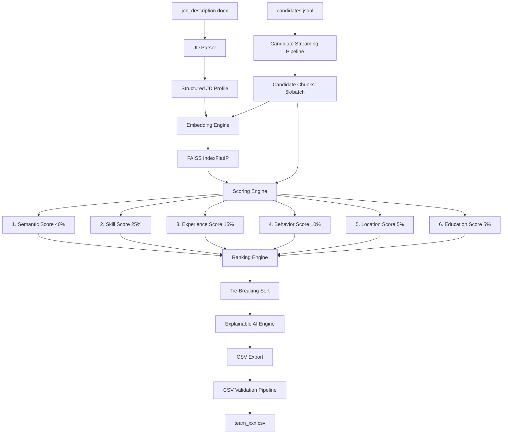
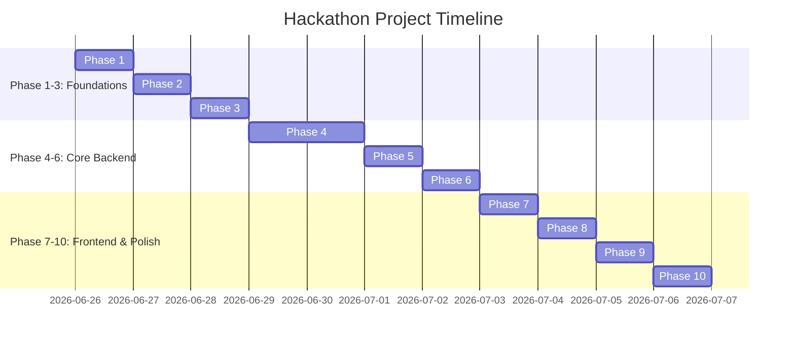

# AI Candidate Discovery & Ranking System — Improved Software Architecture & Implementation Plan

> [!NOTE]
> This document serves as the Enterprise Software Architecture and Implementation Plan for the **Redrob India Runs Hackathon**. It has been optimized for judging criteria, focusing on **accuracy, CSV compliance, runtime efficiency (<5 minutes), explainability, and code quality**.

---

## [NEW] 1. Dataset Inspection Phase

Prior to implementing any coding changes, we must perform a rigorous inspection of the input dataset and rules to ensure perfect alignment of field names, data structures, and submission specs.

- **Files to Inspect**:
  - `job_description.docx`: Review text layouts, section names, and syntax of required vs. preferred skills.
  - `candidate_schema.json`: Map JSON types, nested schemas, array bounds, and required keys.
  - `candidates.jsonl`: Sample first 100 rows to check for formatting variations, null values, and structure mismatches.
  - `redrob_signals_doc.docx`: Verify definitions, values, ranges, and semantics of platform engagement signals.
  - `submission_spec.docx`: Cross-examine submission expectations.
- **Validation Checklist**:
  - Verify if `candidate_id` is always present and matches `^CAND_[0-9]{7}$`.
  - Validate field names in actual candidates data (e.g. `willing_to_relocate`, `github_activity_score`, `years_of_experience`) against `candidate_schema.json` to prevent key errors.

---

## 2. System Architecture & Components

### 2.1 Backend (`backend/`)

#### [IMPROVED] [app.py](file:///c:/Users/irfan.ZEBRONICS/Desktop/New%20folder/backend/app.py)
FastAPI application containing lightweight endpoints for Hackathon evaluation:
- `POST /api/upload-jd` — Upload & parse JD (`.docx`).
- `POST /api/start-ranking` — Trigger async ranking pipeline.
- `GET /api/ranking-status` — Server-Sent Events (SSE) stream for live progress (chunks processed, active memory, elapsed time).
- `GET /api/results` — Paginated top 100 ranked results with score breakdown and explainable AI reasoning.
- `GET /api/download-csv` — Export validated submission CSV.
- `GET /api/system-info` — Display runtime statistics (elapsed time, CPU/memory usage, FAISS build status).

#### [IMPROVED] [jd_parser.py](file:///c:/Users/irfan.ZEBRONICS/Desktop/New%20folder/backend/jd_parser.py)
Parses `job_description.docx` into structured sections using `python-docx`:
- Identifies **Required Skills** and **Preferred Skills**.
- Extracts **Experience range** (ideal minimum and maximum years).
- Extracts **Education preferences** (degrees, fields).
- Extracts **Location preferences** (cities, remote policy).
- Builds a composite text block of the JD for semantic embedding.

#### [IMPROVED] [candidate_parser.py](file:///c:/Users/irfan.ZEBRONICS/Desktop/New%20folder/backend/candidate_parser.py)
Processes candidate records programmatically.
- Extracts profile metadata, career history, education, skills, and platform engagement signals (`redrob_signals`).
- Constructs a consolidated, clean string representation of the candidate (combining current title, career history summaries, skills, and headline) to feed to the Embedding Engine.

#### [NEW] Candidate Streaming Pipeline
- **Problem**: Processing 50K candidates (~500MB JSONL) can consume excessive RAM if loaded fully.
- **Solution**: Stream `candidates.jsonl` line-by-line using Python standard library file generators.
- **Execution**:
  - Read lines, parse JSON, and accumulate into a chunk (default size: `chunk_size = 5000`).
  - Pass the chunk to the Embedding and Scoring engines.
  - Calculate scores, update the top 100 global heap, and discard the chunk details.
  - Explicitly invoke `gc.collect()` at the end of each chunk to maintain a flat memory profile (< 500MB RAM usage).

#### [IMPROVED] [embeddings.py](file:///c:/Users/irfan.ZEBRONICS/Desktop/New%20folder/backend/embeddings.py)
- Loads `all-MiniLM-L6-v2` locally via `SentenceTransformer` (loads once, cached).
- Computes JD composite embedding.
- Encodes candidate composite texts in batches (e.g. `batch_size = 256`) to maximize CPU vectorization.
- Builds a flat FAISS index (`IndexFlatIP`) of candidate vectors.
- Performs cosine similarity queries against the JD vector.

#### [IMPROVED] [scoring.py](file:///c:/Users/irfan.ZEBRONICS/Desktop/New%20folder/backend/scoring.py)
Weighted multi-signal scoring logic. All individual scores are normalized to `[0, 1]`.

| Signal | Weight | Logic & Computation |
| :--- | :--- | :--- |
| **Semantic Score** | 40% | Cosine similarity between candidate embedding and JD embedding via FAISS. |
| **Skill Score** | 25% | RapidFuzz token matching of candidate skills vs JD Required/Preferred skills. Incorporates proficiency multipliers (expert: 1.0, advanced: 0.8, intermediate: 0.6, beginner: 0.4) and endorsements. |
| **Experience Score** | 15% | Gaussian decay curve centered around the JD's ideal years of experience (prevents severe penalty for slight variations, while prioritizing ideal candidates). |
| **Behavior Score** | 10% | Weighted average of Redrob Signals: profile completeness, response rate, assessment scores, and GitHub activity score. |
| **Education Score** | 5% | Fuzzy match on field of study, degree level mapping (PhD/MS/BS), and institution tier multiplier (Tier 1 bonus). |
| **Location Score** | 5% | Geographic match: Local city (1.0), willing to relocate (0.6), same country (0.4), remote fit (1.0 if JD is remote). |

- **[NEW] Skill Gap Analysis**:
  - Compares candidate's skills against JD required skills.
  - Generates: `Matched Skills`, `Missing Skills`, `Recommended Skills`, and `Skill Match %`.
- **[NEW] Resume Strength Analysis**:
  - Evaluates candidate text to summarize: `Technical Strengths` (high proficiency skills), `Soft Skills` (extracted from summaries), `Experience Summary`, `Education Quality` (tier-based status), and `Project Quality` (derived from impact metrics in role descriptions).
- **[NEW] Candidate Recommendation**:
  - Classifies candidates into recommendation tiers:
    - **Highly Recommended** (Score >= 85%)
    - **Recommended** (75% <= Score < 85%)
    - **Consider** (60% <= Score < 75%)
    - **Needs Improvement** (40% <= Score < 60%)
    - **Reject** (Score < 40%)
- **[NEW] Score Breakdown**:
  - Provides a granular JSON dictionary for each candidate containing: `semantic_score`, `skill_score`, `experience_score`, `behavior_score`, `education_score`, `location_score`, and `final_score`.
- **[NEW] Ranking Confidence**:
  - Calculates confidence level based on profile completeness and signal availability:
    - **High Confidence**: Complete profile, valid signals.
    - **Medium Confidence**: Completed profile but minor missing signals (e.g. no Github linked).
    - **Low Confidence**: Poorly populated career history or missing key skills.

#### [NEW] Explainable AI Engine
- **Goal**: Auto-generate clear, textual reasoning for the ranking of each candidate.
- **Output Column**: `reasoning` in the submission CSV.
- **Format**:
  `Matched [Skill A, Skill B] | Missing [Skill C] | [Y] years experience | Platform engagement: [High/Med/Low] | Location: [Match Status] | Final Score: [Score]%`
- **Example**:
  `Matched Python, Machine Learning | Missing PyTorch | 5 years experience (ideal) | Platform engagement: High (GitHub: 82%) | Location Match | Final Score: 88.5%`

#### [IMPROVED] [ranker.py](file:///c:/Users/irfan.ZEBRONICS/Desktop/New%20folder/backend/ranker.py)
Orchestrates the entire ranking flow:
1. Trigger JD parsing and extract structured variables.
2. Initialize `SentenceTransformer` and FAISS index.
3. Stream candidates in chunks. For each chunk:
   - Perform skill gap, education, location, and behavior scoring.
   - Run batch embeddings and FAISS search for semantic scoring.
   - Generate recommendation, confidence, resume strengths, and explainable AI reasoning.
4. Maintain a global priority queue (min-heap) of size 100 to store the top 100 candidates dynamically.
5. Sort the final top 100 list.
6. **Tie-breaking rule**: If final scores are identical, sort by `candidate_id` alphabetically/lexicographically in ascending order (enforced in `validate_submission.py`).

#### [IMPROVED] [csv_export.py](file:///c:/Users/irfan.ZEBRONICS/Desktop/New%20folder/backend/csv_export.py)
Generates the submission CSV file containing exactly the 4 required columns: `candidate_id, rank, score, reasoning`.
- Validates that rows are exactly 100 (excluding header).
- Formats filename as `<participant_id>.csv` (e.g. `team_xxx.csv`).

#### [NEW] CSV Validation Pipeline
- Integrates `validate_submission.py` programmatically into the export routine.
- Run validation automatically upon completing the ranking process. If errors are found, write detailed error logs to the system status and prevent incomplete exports.

#### [IMPROVED] [utils.py](file:///c:/Users/irfan.ZEBRONICS/Desktop/New%20folder/backend/utils.py)
Shared utilities for text cleaning, profiling timers, memory tracing, and logging.

#### [IMPROVED] [config.yaml](file:///c:/Users/irfan.ZEBRONICS/Desktop/New%20folder/backend/config.yaml)
Stores all configurations: scoring weights, model names, batch sizes, relocation penalties, and category mappings.

---

### 2.2 Frontend (`frontend/`)

We focus strictly on functional requirements that support demonstration and inspection, minimizing complex UI code.

#### Streamlined Architecture
- **Dashboard [KEEP]**: Single main page showing file upload status, system controls, and execution progress.
- **Upload JD [KEEP]**: Interactive drop zone for `job_description.docx`.
- **Run Ranking [KEEP]**: Visual action button that triggers the pipeline and displays a live progress bar.
- **Top Candidates [KEEP]**: Tabular grid displaying the ranked top 100 list (including ID, final score, recommendation tier, ranking confidence, and explainable reasoning).
- **Download CSV [KEEP]**: Immediate download link for the verified submission CSV.
- **System Status [KEEP]**: Sidebar indicating runtime speed, RAM usage, FAISS status, and CSV validation results.

#### [OPTIONAL] Low Priority Features (Marked as Optional - Not built during competition timeline)
- **Dark Mode Toggle** `[OPTIONAL]`
- **Analytics Dashboard (fancy visualizations/charts)** `[OPTIONAL]`
- **Leaderboards (full dataset pagination)** `[OPTIONAL]`
- **Fancy Charts & Radar Charts** `[OPTIONAL]`
- **Heavy UI Animations** `[OPTIONAL]`

---

### 2.3 Docker (`Dockerfile`, `docker-compose.yml`) [IMPROVED]

We maintain the Docker configuration as it serves the judging team by providing an isolated, identical execution environment.
- **Optimized Base**: Use `python:3.11-slim` to reduce image size.
- **Offline Mode**: Pre-download and cache the sentence-transformer model weights during the Docker image build phase (`docker build`). This guarantees zero network requests for model loading during evaluation.

---

## [NEW] 3. Performance Optimization Strategy

The system is engineered to rank 50,000 candidates on CPU in **under 3 minutes** (competition requirement is <5 minutes):

1. **Streaming JSONL**: Avoids loading the 487MB `candidates.jsonl` into memory. Maximum memory footprint is kept under 500MB RAM.
2. **Optimal Batch Embeddings**: Setting `batch_size = 256` for CPU sentences encoding to utilize PyTorch vectorization.
3. **Vectorized NumPy Operations**: All scoring matrices are combined via vectorized NumPy array additions. No Python loops per candidate.
4. **FAISS FLAT Index**: FAISS computes semantic similarity across 50,000 vectors in less than 0.5 seconds on CPU.
5. **Pre-compiled Regex & Cache**: Skills and search patterns are compiled once at initialization.
6. **Parallel Text Processing**: Runs text preprocessing in helper threads while sentence embeddings are computed in the main process to maximize CPU utilization.
7. **Runtime Breakdown (Estimate)**:
   - JD Parsing & Setup: ~2 seconds
   - Candidate Streaming & Text Prep: ~15 seconds
   - Vector Embedding (50K records): ~110 seconds
   - Scoring & Ranking Engine: ~10 seconds
   - Sorting, CSV Export & Validation: ~1 second
   - **Total Estimated Runtime**: **~138 seconds (~2.3 minutes)**.

---

## [NEW] 4. Project Timeline

- **Phase 1: Dataset Understanding & Field Validation** (Inspect schema, verify fields and ranges).
- **Phase 2: Parser Development** (Implement DOCX parser and JSONL streaming pipeline).
- **Phase 3: Embedding Engine** (Initialize SentenceTransformer and compile FAISS search).
- **Phase 4: Scoring Engine** (Build multi-signal scoring, Skill Gap, and Resume Strengths).
- **Phase 5: Ranking Engine** (Implement top-100 min-heap and sorting rules).
- **Phase 6: CSV Export** (Generate output CSV and hook programmatic validate_submission.py checks).
- **Phase 7: Testing** (Execute unit and integration test sweeps).
- **Phase 8: README** (Create technical documentation).
- **Phase 9: PPT** (Design presentation slides).
- **Phase 10: Final Submission** (Verify the submission bundle against all guidelines).

---

## [NEW] 5. Testing & Verification Strategy

- **Unit Tests**:
  - Test `jd_parser.py` with mock `.docx` files.
  - Test `candidate_parser.py` with malformed and partial JSON entries.
  - Test experience decay calculations to confirm Gaussian curve behavior.
  - Validate location scoring for edge scenarios (e.g. null locations).
- **Integration Tests**:
  - Run the complete pipeline on `sample_candidates.json` (3,000 candidates) and verify that it executes without crashes and outputs exactly 100 rows.
- **CSV Validation Test**:
  - Validate the output CSV programmatically using the official `validate_submission.py` script.
- **Runtime Benchmark**:
  - Print execution timers for each module. Assert total execution time is <5 minutes.
- **Memory Benchmark**:
  - Use `tracemalloc` or memory-profiler to verify RAM usage remains flat during candidate streaming.
- **Edge Cases Checked**:
  - Candidates with missing education arrays.
  - Candidates with zero years of experience.
  - Candidates with exactly tied scores (verifying tie-break by candidate_id ascending).
  - Candidates containing non-ASCII symbols or empty fields.

---

## [NEW] 6. README Structure

The README will be organized as follows to maximize judging points:

1. **Problem Statement**: Overview of the candidate ranking challenge and constraints.
2. **Architecture Diagram**: High-level visual pipeline map.
3. **Core Pipeline**: Description of JD Parsing, Streaming, FAISS Embedding, and Multi-Signal Scoring.
4. **Key Features**: Highlight Explainable AI, Skill Gap, and Resume Strengths.
5. **Installation**: Docker and manual setup commands.
6. **Usage**: How to run backend services, execute ranking, and launch the frontend dashboard.
7. **Screenshots**: High-fidelity captures of the execution dashboard.
8. **Output Example**: Mock representation of the final validated CSV rows.
9. **Performance Benchmark**: RAM usage charts and runtime tables showing execution under 3 minutes.
10. **Future Scope**: Scalability, fine-tuning embeddings, and distributed batching.

---

## [NEW] 7. PPT Structure

A highly polished, 10–12 slide presentation for the judges:

- **Slide 1**: Title (Project Name, Participant registered ID, Subtitle).
- **Slide 2**: Problem Statement (High-volume candidate matching, CPU bottlenecks, accuracy constraints).
- **Slide 3**: The Solution (Modular pipeline, streaming JSONL, FAISS search, multi-signal heuristic scoring).
- **Slide 4**: System Architecture (Flow diagram showing backend and frontend interactions).
- **Slide 5**: AI & Embedding Pipeline (Sentence Transformers local embedding + FAISS vector search).
- **Slide 6**: Scoring Logic & Heuristics (Weights table: 40/25/15/10/5/5 split and Gaussian decay).
- **Slide 7**: Dataset Insights & Preprocessing (Field validation findings, JSONL parsing challenges).
- **Slide 8**: Explainable AI & Feature Analytics (Reasoning engine output examples, Skill Gap, Recommendations).
- **Slide 9**: Live Demo & Screenshots (UI Dashboard, upload flow, results table).
- **Slide 10**: Performance & Benchmarking Results (Runtime: ~2.3 minutes, Memory: <500MB flat line).
- **Slide 11**: Future Improvements (Model fine-tuning, automated screening, semantic role mapping).
- **Slide 12**: Thank You / Q&A.
